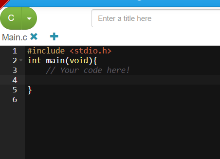
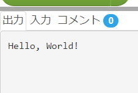
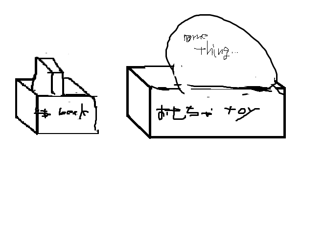
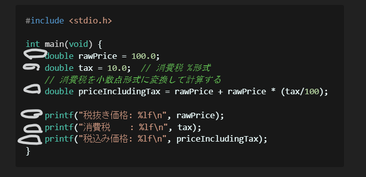
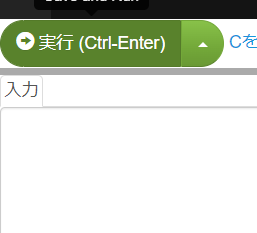
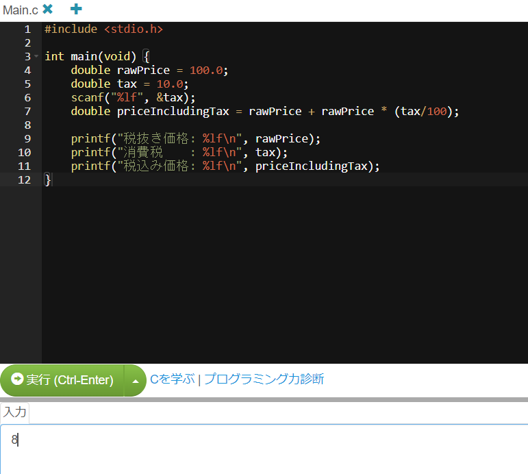

# 入門 C言語

## 目次

1. [注意事項](#注意事項)
1. [実行環境](#実行環境)
1. [C言語に触れてみよう](#c言語に触れてみよう)
1. [プログラムを実行してみよう](#プログラムを実行してみよう)
1. [main関数](#main関数)
1. [変数の宣言と初期化](#変数の宣言と初期化)
    1. [変数名の考え方](#変数名の考え方)
    1. [データの型（数値型）](#データの型数値)
    1. [算術演算子](#算術演算子)
1. [文字を表示する](#文字を表示する)
    1. [変数の出力](#変数の出力数値型)
1. [プリプロセッサについて](#プリプロセッサについて)
1. [コメントを書こう](#コメントを書こう)
1. [インデントを付けよう](#インデントを付けよう)
1. [入力を受け付けよう](#入力を受け付けよう)
1. [条件分岐(if)](#条件分岐if)
1. [関係演算子](#関係演算子)
1. [条件式](#条件式)
1. [ブロック](#ブロック)
1. [条件分岐(else)](#条件分岐else)
1. [条件分岐(else-if)](#条件分岐else-if)
1. [論理演算子](#論理演算子)
1. [条件分岐のネスト](#条件分岐のネスト)
1. [反復処理(for)](#反復処理for)
1. [インクリメント/デクリメント](#インクリメントデクリメント)
1. [反復処理(while)](#反復処理while)
1. [条件分岐(switch)](#条件分岐swicth)
1. [break](#break)
1. [continue](#continue)
1. [反復処理のネスト](#反復処理のネスト)
1. [反復処理(do-while)](#反復処理do-while)
1. [複合代入演算子](#複合代入演算子)

1. 巻末付録
    1. C言語のインストール
    1. WSL2のインストール
    1. コンパイル方法
    1. エラーの対処

1. 参考資料


## 注意事項


## 実行環境

[paiza.io](https://paiza.io/jp)というオンライン環境を用います。

必要に応じて、アカウントを登録してください。

ローカル環境で開発する場合は[巻末付録](#巻末付録)の[C言語のインストール](#c言語のインストール)を参照されたい。


## C言語に触れてみよう

**コード作成を試してみる（無料）** をクリックする。


コードエディターが開かれるので、左上にあるPHPの横の▼をクリックし、Cをクリックする。


以下のような画面になったら、C言語のプログラムを実行することができます。


**実行**ボタン、もしくは`Ctrl-Enter`キーを押すことで実行できます。

## プログラムを実行してみよう

4行目に`printf("Hello, World!\n");`を追加してください。

プログラム
```c
#include <stdio.h>
int main(void){
    // Your code here!
    printf("Hello, World!\n");
}
```

その後、実行してみましょう。



上記のように表示されたでしょうか。

実行されなかった人はプログラムをもう一度確認するか、上記のコードをコピーして貼り付けて実行してみてください。

## main関数

```c
int main(void) {
    ...
}
```

上記のコードを`main`関数と呼びます。

C言語では、この`main`関数がプログラム開始の起点となります。

現時点では、`int`や`void`などのことはわからなくても大丈夫です。

## 変数の宣言と初期化

プログラムには変数というものがあります。

変数はデータを格納する入れ物です。

変数の宣言は`int var;`のように記述します.

プログラム
```c
#include <stdio.h>
int main(void) {
    int var;
}
```

`int`はデータの型で、`var`が変数の名前になります。

それは例えば、以下の画像のようなことです。



本を入れるbookという箱、おもちゃを入れるtoyという箱などをイメージしてみるとわかりやすいでしょう。（おそらく…）

宣言は、箱を用意しただけに過ぎません。

そこで、**初期化**を行なう必要があります。

初期化は`int var=0;`のように記述します。

プログラム
```c
#include <stdio.h>
int main(void) {
    int var=0;
}
```

宣言と初期化をまとめて、**定義**と呼びます。

### 変数名の考え方

変数の名前はどんな名前をつけてもいいです。

ですが、読みにくい名前は避けるべきです。


例えば、あなたは自分の子どもに「あああ」という名前をつけるでしょうか？

それに似ています。

変数名のプラクティス

例として、「消費税込みの金額」を入れる変数の名前を考えます。

+ 名詞を意識する
    ```
    bad: zeikomidayo
    nice: zeikomikakaku
    ```
+ ローマ字にしない
    ```
    bad: zeikomikakaku, ...
    nice: p, price
    ```
+ 短いよりも長い名前
    ```
    bad: p, pr, pri, prc, ...
    nice: price
    ```
+ 意味のある名前（必要な情報を入れる）
    ```
    bad: price, ...
    nice: priceIncludingConsumptionTax
    ```
+ 不要な単語は省く
    ```
    bad: priceIncludingConsumptionTax
    nice: priceIncludingTax
    ```


上記を守れば、それなりにわかりやすい変数名を考えることができると思います。

最初からすべて考慮しながら変数名を考えることは難しいと思うので、まずはローマ字にしない、意味のある名前にするなどを意識しながら考えるのがいいと思います。


### データの型（数値）

|型名|入るもの|具体的な値|
|:--:|:--:|:--:|
|int|整数| -1234, -1, 0, 1, 123, 4567など |
|double|実数(倍精度)| 3.1415など |
|float|実数(単精度)| 3.14など |

※何かしらの事情がない限りは`float`よりも`double`を使うべきです。

### 算術演算子

変数を使って計算をすることができます。

そのためには**算術演算子**が必要です。

以下にまとめます。

|演算子|名前|記述例|意味|
|:--:|:--:|:--:|:--:|
|+|加算| `a + b` |aにbを加える|
|-|減算| `a - b` |aからbを引く|
|\*|乗算| `a \* b` |aにbを掛ける|
|/|除算| `a / b` |aをbで割る|
|%|剰余| `a % b` |aをbで割った余り|

優先順位は数学等と同じで、`()`を用いることもできます。

ここまでで、簡単な計算をするプログラムを作成することができるようになったと思います。


## 文字を表示する

簡単な計算をするプログラムを書けるようになりましたが、それだけでは処理が（正常に）完了したかどうかわかりません。

そこで、画面に文字を表示させましょう。

文字を表示するには、`printf`関数を用います。

`printf`関数を使うには`#include <stdio.h>`という文が必要なので、なければ1行目に記述してください。

プログラム
```c
#include <stdio.h>

int main(void) {
    printf("Hello, World!");
}
```

このように使います。

`printf()`の`()`の中にダブルクォーテーション(`"`)でくくった出力したい文字を入力します。

プログラム
```c
#include <stdio.h>

int main(void) {
    printf("Hello, World!");
    printf("こんにちは、世界！");
    printf("出力される文字");
}
```

実行結果
```result: 実行結果
Hello, World!こんにちは、世界！出力される文字
```
上記のように表示されたかと思います。

改行するためには`\n`を出力したい文字に付け足す必要があります。

プログラム
```c
#include <stdio.h>

int main(void) {
    printf("Hello, World!\n");
    printf("こんにちは、世界！\n");
    printf("出力される文字\n");
}
```

実行結果
```result: 実行結果
Hello, World!
こんにちは、世界！
出力される文字
```

`\n`は**エスケープシーケンス文字**といって、出力する文字の制御をする特殊な文字列です。

`\n`には**改行**が割り当てられています。

### 変数の出力（数値型）

変数を出力してみましょう。

例として、税抜き価格と消費税から税込み価格を計算してそれを表示するプログラムを作成してみます。

プログラム
```c
#include <stdio.h>

int main(void) {
    double rawPrice = 100.0;
    double tax = 10.0;
    double priceIncludingTax = rawPrice + rawPrice * (tax/100);

    printf("税抜き価格: rawPrice\n");
    printf("消費税    : tax\n");
    printf("税込み価格: priceIncludingTax\n");
}
```

実行結果
```
税抜き価格: rawPrice
消費税    : tax
税込み価格: priceIncludingTax
```

変数の名前がそのまま出力されてしまいましたね。

変数の中身を出力したいときは、出力したい文字列の中に`%d`や`%lf`などを使って、`printf("税抜き価格: %lf\n", rawPrice);`のように記述します。

`%d`は整数型の変数を、`%lf`は実数型の変数を出力します。

先ほどのプログラムを書き換えてみましょう。

プログラム
```c
#include <stdio.h>

int main(void) {
    double rawPrice = 100.0;
    double tax = 10.0;
    double priceIncludingTax = rawPrice + rawPrice * (tax/100);

    printf("税抜き価格: %lf\n", rawPrice);
    printf("消費税    : %lf\n", tax);
    printf("税込み価格: %lf\n", priceIncludingTax);
}
```

実行結果
```
税抜き価格: 100.000000
消費税    : 10.000000
税込み価格: 110.000000
```

これで、思った通りに動いたと思います。

しかし、これでは見栄えが悪いのでフォーマットを揃えたいですね。

そうです、できちゃうんです。

`%(表示幅).(小数点以下の表示幅)lf`や`%(表示幅)d`のように記述します。


税抜き価格、税込み価格を小数点以下2桁で、消費税を表示幅3桁、小数点以下0桁で表示してみます。

プログラム
```c
#include <stdio.h>

int main(void) {
    double rawPrice = 100.0;
    double tax = 10.0;
    double priceIncludingTax = rawPrice + rawPrice * (tax/100);

    printf("税抜き価格: %.2lf\n", rawPrice);
    printf("消費税    : %3.0lf\n", tax);
    printf("税込み価格: %.2lf\n", priceIncludingTax);
}
```

実行結果
```
税抜き価格: 100.00
消費税    :  10
税込み価格: 110.00
```

良い感じになりましたね。

色々試してみると面白いかもしれません。

## プリプロセッサについて

プリプロセッサとは、`#include <stdio.h>`のことです。
※この表現は正確ではありません。


`stdio.h`というヘッダーファイルを読み込んでいます。

`stdio.h`は`standard input/output`の略で標準入出力の関数が定義されているファイルです。

このファイルを読み込むことで、`printf`関数や後述する`scanf`関数を使うことができるようになります。


## コメントを書こう

コメントは、プログラム中に書くメモ書きや注意などのことです。
適切に書くことで、他人にわかりやすいプログラムにすることができます。

`//`で一行コメント、`/* */`で複数行コメントを記述できます。

プログラム
```c
#include <stdio.h>

int main(void) {
    // rawPrice 税抜き価格
    double rawPrice = 100.0;
    // tax 消費税
    double tax = 10.0;
    // priceIncludingTax 税込み価格
    double priceIncludingTax = rawPrice + rawPrice * (tax/100);

    printf("税抜き価格: %lf\n", rawPrice);
    printf("消費税    : %lf\n", tax);
    printf("税込み価格: %lf\n", priceIncludingTax);
}
```

このように記述します。

コメントのプラクティス
+ 自明なことは書かない
+ なぜそのコードにしたのか、する必要があったのかを書く

上記を踏まえてもう一度プログラムを書き直すと以下のようになるでしょう。

プログラム
```c
#include <stdio.h>

int main(void) {
    double rawPrice = 100.0;
    double tax = 10.0;  // 消費税 %形式
    // 消費税を小数点形式に変換して計算する
    double priceIncludingTax = rawPrice + rawPrice * (tax/100);

    printf("税抜き価格: %lf\n", rawPrice);
    printf("消費税    : %lf\n", tax);
    printf("税込み価格: %lf\n", priceIncludingTax);
}
```

## インデントを付けよう

インデントは、プログラムを読みやすくするために使います。
C言語のインデントには、タブが使われていることが多いですが、半角スペース（2つまたは4つ）でも大丈夫です。

慣れないうちは、`{}`の中ごとにインデントを増やしていくといいと思います。

下記画像の白丸部分がインデントに当たります。



プログラム
```c
#include <stdio.h>
int main(void){
int n;
n=10;
printf("HelloWorld!\n");
printf("n = %d\n", n);
}
```

プログラム
```c
#include <stdio.h>
int main(void){
    int n;
    n=10;
    printf("HelloWorld!\n");
    printf("n = %d\n", n);
}
```

どちらが見やすいですか？

おそらく、下のほうが見やすいと思います。

インデントすることを意識して書きましょう。

## 入力を受け付けよう

入力を受け付けるには、`scanf`関数を用います。

`scanf`関数は`scanf(指定子, &変数名);`のように記述します。

指定子は、`%d`や`%lf`などを使います。

変数名の前に`&`が必要なので、忘れないようにしましょう。

プログラム
```c
#include <stdio.h>

int main(void) {
    double rawPrice = 100.0;
    double tax = 10.0;
    scanf("%lf", &tax);
    double priceIncludingTax = rawPrice + rawPrice * (tax/100);

    printf("税抜き価格: %lf\n", rawPrice);
    printf("消費税    : %lf\n", tax);
    printf("税込み価格: %lf\n", priceIncludingTax);
}
```

[paiza.io](https://paiza.io/jp)では、以下の「入力」の欄に入力します。




以下の画像のようにすると実行することができます。



実行結果
```result: 実行結果
税抜き価格: 100.000000
消費税    : 8.000000
税込み価格: 108.000000
```

`8`を入力したので、消費税を**10**%から**8**%にすることができました。

## 変数に代入しよう

変数の値を途中で変えたいこと、ありますよね。

そのときは、**代入**をします。

`var = 10;`のように記述します。

実は、変数の初期化は宣言と代入だったのです。

プログラム
```c
#include <stdio.h>

int main(void) {
    int var = 10;
    printf("var = %d\n", var);
    var = 20;
    printf("var = %d\n", var);
}
```

実行結果
```result: 実行結果
var = 10
var = 20
```

## 条件分岐(if)

例えば、ある値が一定値を超えたらある処理をしたいという場面がありますよね。

そういうときに条件分岐(`if`)が使えます。

`if (条件式) { ある処理 } `のように記述します。

実際に

プログラム
```c
#include <stdio.h>

int main(void) {
    int temperature = 25;

    if (temperature >= 25) {
        printf("It is warm today!\n");
    }

    printf("Hello World!\n");
}
```

実行結果
```
It is warm today!
Hello World!
```

プログラム
```c
#include <stdio.h>

int main(void) {
    int temperature = 15;

    if (temperature >= 25) {
        printf("It is warm today!\n");
    }

    printf("Hello World!\n");
}
```

実行結果
```
Hello World!
```

上記のように記述します。


## 関係演算子

関係演算子とは、一致・不一致や大小の比較を行なうための演算子です。

比較演算子とも言います。

結果を真偽値(true/false)で返します。

関係演算子を以下にまとめます。

|演算子|記述例|意味|
|:--:|:--:|:--:|
| == | `a == b` | aとbが同じか|
| != | `a != b` | aとbが異なるか|
| <  | `a < b`  | aがbより小さいか|
| >  | `a > b`  | aがbより大きいか|
| <= | `a <= b` | aがb以下か|
| >= | `a >= b`   | aがb以上か|

先ほどのプログラム中の`temperature >= 25`は **temperatureが25以上かどうか?** ということだったのです。

## 条件式

`if`文のところにも出てきました。

条件式は値や式の比較などを組み合わせたものです。

`if`文のほかに後述する`while`文や`switch`文などに使います。

## ブロック

ブロックは、`if`文や`while`文などの**スコープ**を表します。

スコープとは範囲のことで、`if`や`while`の処理の範囲と捉えて大丈夫です。

ブロックは`{ ... }`と記述します。

プログラム
```c
#include <stdio.h>

int main(void) {
    int tempareture = 25;

    if (tempareture >= 25) {
        // if文のブロック(スコープ)
        printf("It is warm today!\n");
    }
}
```

## 条件分岐(else)

さて、`if`での条件分岐はできるようになりましたが、
それ以外の時の処理をしたい場合はどうすればいいのでしょうか？

`if`の後ろに`else`という文を追加します。
`(if { ... }) else { ... }`と記述します。

プログラム
```c
#include <stdio.h>

int main(void) {
    int tempareture = 25;

    if (tempareture >= 25) {
        printf("It is warm today!\n");
    } else {
        printf("It is comfortable today!\n");
    }

    printf("Hello World!\n");
}
```

実行結果
```result: 実行結果
It is warm today!
Hello World!
```

プログラム
```c
#include <stdio.h>

int main(void) {
    int tempareture = 20;

    if (tempareture >= 25) {
        printf("It is warm today!\n");
    } else {
        printf("It is comfortable today!\n");
    }

    printf("Hello World!\n");
}
```

実行結果
```result: 実行結果
It is comfortable today!
Hello World!
```

このように、`if`の条件に合うときは`if`のブロックが、そうでないときに`else`のブロックの処理を行ないます。

## 条件分岐(else-if)

では、複数の条件があるときはどうすればいいでしょうか。

`if`と`else`を組み合わせればいいのです。

`if`と`else`の間に`else if`を追加します。

`if (条件式) { ... } else if (条件式) { ... } else { ... }`のように記述します。

プログラム
```c
#include <stdio.h>

int main(void) {
    int tempareture = -3;

    if (tempareture >= 25) {
        printf("It is warm today!\n");
    } else if (tempareture <= 0) {
        printf("It is cold today!\n");
    } else {
        printf("It is comfortable today!\n");
    }

    printf("Hello World!\n");
}

```

実行結果
```
It is cold today!
Hello World!
```

`else-if`は複数個あっても大丈夫です。

ただし、複数の条件に合致していても、実行されるのはプログラムで一番上（最初）の処理だけになります。

プログラム
```c
#include <stdio.h>

int main(void) {
    int age = 76;

    if (age >= 18) {
        printf("You are an adult\n!");
    } else if (age >= 75) {
        printf("You are an old!\n");
    } else if (age < 18) {
        printf("You are a child!\n");
    } else if (age < 0) {
        printf("You are not born yet\n");
    } else {
        printf("You are not human!\n");
    }
}
```

実行結果
```
You are an adult!
```

書く順番に気を付けましょう。

## 論理演算子

論理演算子は、主に複数の条件式を組み合わせるために使います。

`&&`、`||`、`!`などの記号を用います。

以下に説明を記します。

|記号|名前|用例|説明|
|:--:|:--:|:--:|:--:|
|&&|論理積|`(条件1) && (条件2)`|条件1と条件2に合致しているか|
|\|\||論理和|`(条件1) \|\| (条件2)`|条件1または条件2に合致しているか|
|!|否定|`!(条件式)`|条件式の反対|

プログラム
```c
#include <stdio.h>

int main(void) {
    int tempareture = 20;

    if (tempareture >= 15 && tempareture <= 25) {
        printf("It is comfortable today!\n");
    } else if (tempareture > 25 && tempareture < 35) {
        printf("It is warm today!\n");
    } else if (tempareture > 0 && tempareture < 15) {
        printf("It is cold today!\n");
    } else {
        printf("It is too cold/warm today!\n");
    }
}
```

実行結果
```result: 実行結果
It is comfortable today!
```

条件を複数個つなげることもできます。

## 条件分岐のネスト

`if`や`else`の中にさらに`if`などをいれることができます。

プログラム
```c
#include <stdio.h>

int main(void) {
    int num = 20;

    if (num >= 0) {
        if (num <= 100) {
            printf("numは0以上100以下です\n");
        } else {
            printf("numは100より大きいです\n");
        }
    } else {
        printf("numは負数です\n");
    }
}
```

実行結果
```result: 実行結果
numは0以上100以下です
```

しかし、`if`文のネストは読みにくくなりやすいので、使いすぎには注意しましょう。


## 反復処理(for)

何回か処理を行いたい場合ってありますよね。

例えば、10回同じ処理を繰り返したいとかそういう場合です。

そのときは、`for`文を使いましょう。

`for (初期化子; 条件式; 変化式) { 処理 }`のように記述します。

例えば、1から10まで出力したい場合は以下のようなプログラムになります。

プログラム
```c
#include <stdio.h>

int main(void) {
    for (int i=1; i<=10; i++) {
        printf("%d\n", i);  // int型変数を出力するため[%d]を用いる
    }

    // このように記述してもよい
    /* int i;
     * for (i=1; i<=10; i=i+1) {
     *    printf("%d\n", i);
     * }
     */

}
```

実行結果
```result: 実行結果
1
2
3
4
5
6
7
8
9
10
```

**配列**などを使うときによく使うので、覚えておきましょう。

配列については、後述します。

## インクリメント/デクリメント

**インクリメント/デクリメント**とは、`for`文中に出てきた、`i++`のことです。

`i++`をインクリメントと呼びます。

また、`i--`をデクリメントと呼びます。

これは、`i`に`1`ずつ加算/減算するという意味です。

`i+=1`(`i=i+1`)や`i-=1`(`i=i-1`)と等価です。

主に`for`文や`while`文（後述）で使いますが、通常のプログラム中にも使うことができます。

プログラム
```c
#include <stdio.h>

int main(void) {
    int i = 0;

    printf("i = %d\n", i);
    i++;
    printf("i = %d\n", i);
    i--;
    printf("i = %d\n", i);
}
```

実行結果
```result: 実行結果
i = 0
i = 1
i = 0
```

また、前置(`++i`など)や後置(`i++`など)ありますが、ここでは触れません。

気になる方は、調べてみると良いでしょう。

## 反復処理(while)

`for`文と似たような処理をする`while`文があります。

こちらも反復処理ですが、何が違うのか？というと、

`while`文は`for`文と違って**回数を気にしない**のが特徴です。

どういうことかというと、何回処理を繰り返すかわからない処理に使えるということです。

例えば、ゲームなどのプログラムで使われていると思います。

`while (条件式) { 繰り返したい処理 }`のように記述します。

プログラム
```c
#include <studio.h>

int main(void) {
    int i;
    i = 0;
    while (i < 10) {
        printf("%d\n", i);
        i++;
    }
}
```

実行結果
```
0
1
2
3
4
5
6
7
8
9
```

また、**回数を気にしない**ということは**無限**も可能ということです。

条件式に`1`と記述すると無限ループになります。

プログラム
```c
#include <studio.h>

int main(void) {
    while (1) {
        printf("help!\n");
    }
}
```

実行結果
```
help!
help!
.
.
.
```

## 条件分岐(switch)

条件分岐として、`if`文の他に`switch`文があります。

主に、分岐が複数(3つ以上)のときに使われます。

```c
switch (式) {
    case 値1:
        処理;
        break;
    case 値2:
        処理;
        break;
    default:
        処理;
}
```

のように記述します。

**式**が**値**と一致した場合、その処理を行い、どの値にも一致しなかった場合`default`の処理をします。

また、各`case`ごとに`break`を記述しなければいけません。（記述しなくてもエラーにはなりませんが…）

とりあえず、サンプルプログラムを見てみましょう。

プログラム
```c
#include <stdio.h>

int main(void) {
    int month;
    month = 2;

    switch (month) {
        case 1:
            printf("1月\n");
            break;
        case 2:
            printf("2月\n");
            break;
        case 3:
            printf("3月\n");
            break;
        case 4:
            printf("4月\n");
            break;

        ...  // 5~12は省略

        default:
            printf("入力された月はありません\n");
    }
}
```

実行結果
```result:
2月
```

`if`文では毎回条件式に`month==1`のように記述しないといけないので大変ですが、`switch`ではその必要はありません。

ちなみに、`break`を省略した場合は以下のようになります。

プログラム
```c
#include <stdio.h>

int main(void) {
    int month;
    month = 2;

    switch (month) {
        case 1:
            printf("1月\n");
        case 2:
            printf("2月\n");
        case 3:
            printf("3月\n");
        case 4:
            printf("4月\n");

        ...  // 5~12は省略

        default:
            printf("入力された月はありません\n");
    }
}
```

実行結果
```result:
2月
3月
4月
...
入力された月はありません
```

このようになってしまうので、`break`のつけ忘れには注意しましょう。

## break

さて、`switch`文に出てきた`break`はなんでしょうか。

直訳すると、**壊す**ですね。

反復処理や`switch`の処理を中断させたいときに`break`を使います。

反復処理のときは`if`文と組み合わせることが多いです。

プログラム
```c
#include <stido.h>

int main(void) {

    for (int i=0; i<10; i++) {
        if (i == 3) {
            break;
        }
        printf("i = %d\n", i);
    }
}
```

実行結果
```result
i = 0
i = 1
i = 2
i = 3
```

`switch`文のときは[条件分岐(switch)](#条件分岐(switch))の通りです。

また、`for`文だけではなく`while`文でも同様に使うことができます。


## continue

次に、反復処理中にある（条件の）時だけ処理を行わないようにしたい場合もありますよね。

そのときに使えるのが`continue`文です。

こちらも`if`文と組み合わせて使うことが多いです。

`continue`文以降は実行されず、次の反復処理に移ります。

プログラム
```c
#include <stdio.h>

int main(void) {
    for (int i=0; i<5; i++) {
        if (i == 3) {
            continue;
        }
        printf("%d\n", i);
    }
}
```

実行結果
```result
0
1
2
4
5
```

このように実行されます。

## 反復処理のネスト

次に反復処理の**ネスト**を説明します。

ネストとは、日本語で入れ子いい、この場合反復処理の中に反復処理を書くことを指します。

`for`や`while`文は処理をN回繰り返す命令でした。
その中にもうひとつ(以上)の反復処理を書くので、処理をN*M回繰り返すこととなります。

具体的な例として、九九を表示してみましょう。

プログラム
```c
#include <stdio.h>

int main(void) {
    for (int n=1; n<10; n++) {
        for (int m=1; m<10; m++) {
            printf("%2d ", n*m);
        }
        printf("\n");
    }
}
```

実行結果
```
 1  2  3  4  5  6  7  8  9
 2  4  6  8 10 12 14 16 18
 3  6  9 12 15 18 21 24 27
 4  8 12 16 20 24 28 32 36
 5 10 15 20 25 30 35 40 45
 6 12 18 24 30 36 42 48 54
 7 14 21 28 35 42 49 56 63
 8 16 24 32 40 48 56 64 72
 9 18 27 36 45 54 63 72 81
```

このように、内側のループが行、外側のループが列になります。
（この例がわかりにくいなら、内側か外側のループの条件式を変えてみるとわかりやすいよ）

内側のループの条件式を`m<5`に変えて実行してみましょう。

プログラム
```c
#include <stdio.h>

int main(void) {
    for (int n=1; n<10; n++) {
        for (int m=1; m<5; m++) {
            printf("%2d ", n*m);
        }
        printf("\n");
    }
}
```

実行結果
```
 1  2  3  4
 2  4  6  8
 3  6  9 12
 4  8 12 16
 5 10 15 20
 6 12 18 24
 7 14 21 28
 8 16 24 32
 9 18 27 36
```

ゲームプログラムにも反復処理のネストをよく使われます。

いまいちわからないかもしれないですが、手を動かすことでわかるようになると思います。


## 反復処理(do-while)

## 複合代入演算子


## 巻末付録

### C言語のインストール

### WSL2のインストール

### コンパイル方法

### エラーの対処


## 参考資料

